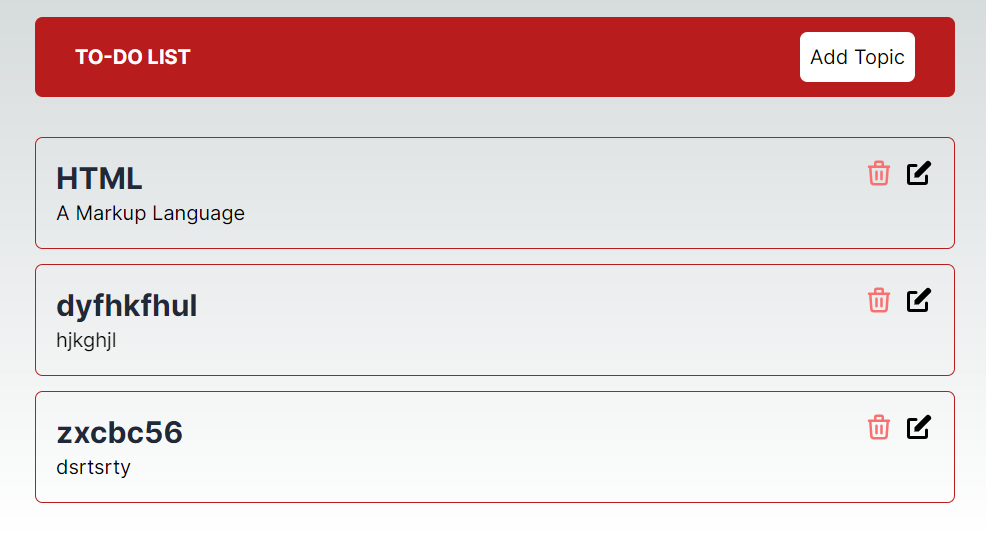

CRUD App with MongoDB

## Visulation of the Website



## Description

Project aims get information about CRUD App with MongoDB via a Javascript React with Next.js framework and MongoDB.

## Learning Outcomes

At the end of the this project, you will be able to;

- improve coding skills within ReactJS, Next.js, Tailwindcss, MongoDB.

- use git commands (push, pull, commit, add etc.) and Github as Version Control System.
# Getting Started with Create React App

```
CRUD-App-with-MongoDB(folder)
|
|----readme.md
SOLUTION
├── app
├── assets
├── components
├── libs
├── models
├── public
│     └── About.tsx
│     └── BgCircle.tsx
│     └── Contact.tsx
│     └── Header.tsx
│     └── MoonIcon.tsx
│     └── Projects.tsx
│     └── Skill.tsx
│     └── Skills.tsx
│     └── SunIcon.tsx
├── public
│    ├── components
│    │       ├── form
│    │       │     └── Form.js
│    │       └── table
│    │             └── Table.js
│    ├── utils
│    │       ├── customToastify.js
│    │       ├── functions.js
│    │       └── firebase.js
│    ├── App.js
│    ├── App.css
│    ├── index.js
│    ├── Animation.gif
│    └── index.css
├── package.json
└── yarn.lock
```
